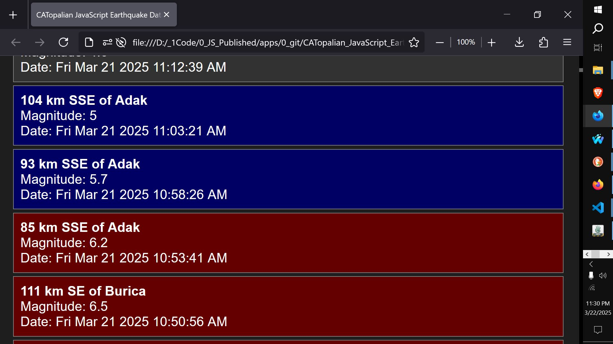

# CATopalian JavaScript Earthquake Data Center
A JavaScript application that gets all recent Earthquake data and color codes each Earthquake to make it easy to search by most recent earthquakes which ones were big (red), medium (blue) and small (gray). This makes it easier for scientists to read the data.  

USE APP: https://christopherandrewtopalian.github.io/CATopalian_JavaScript_Earthquake_Data_Center/CATopalian_JavaScript_Earthquake_Data_Center.html  

  

---

### How to Download this App
1. Click the green Code Button on this github page
2. Choose Download ZIP
3. Save the Zip File
4. Extract All
5. Double click the HTML file to start the App

---

Happy Scripting :-)

---

// Dedicated to God the Father  
// All Rights Reserved Christopher Andrew Topalian Copyright 2000-2026  
// https://github.com/ChristopherTopalian  
// https://github.com/ChristopherAndrewTopalian  
// https://sites.google.com/view/CollegeOfScripting  

